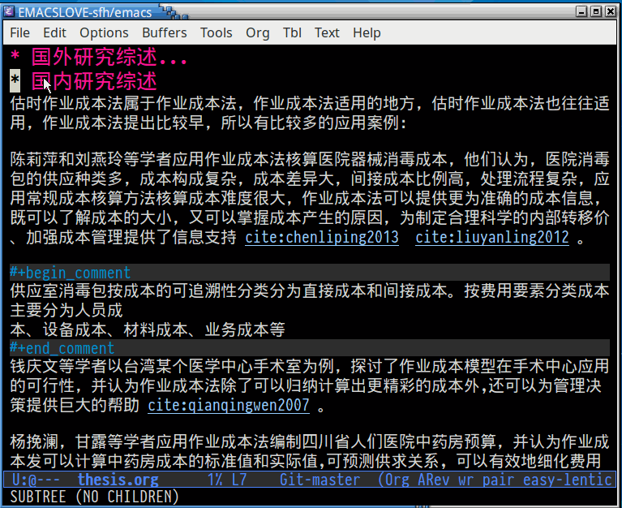

- [README](#org7ed6be1)
  - [Introduce](#org82b749c)
  - [Install](#org35e96a6)
  - [Configure](#orgff15667)
  - [Usage](#org3297ef1)

# README

## Introduce

This package cannot work again, please don't install it &#x2026;..

ebib-handy is a ebib tool, which can let ebib become a cite chooser. 

## Install

1.  Config melpa: <http://melpa.org/#/getting-started>
2.  M-x package-install RET ebib-handy RET

## Configure

    (require 'ebib-handy)
    (ebib-handy-enable)

    (setq ebib-extra-fields
          '((BibTeX "keywords" "abstract" "timestamp"
                    "file"  "url" "crossref" "annote" "doi")
            (biblatex "keywords" "abstract" "timestamp"
                      "file"  "url" "crossref" "annote" "doi")))

## Usage

    (global-set-key "\C-c b" 'ebib-handy)

You can open "example/thesis.org" then type 'C-c b'.